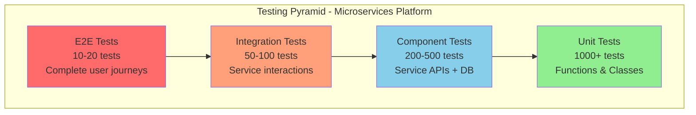
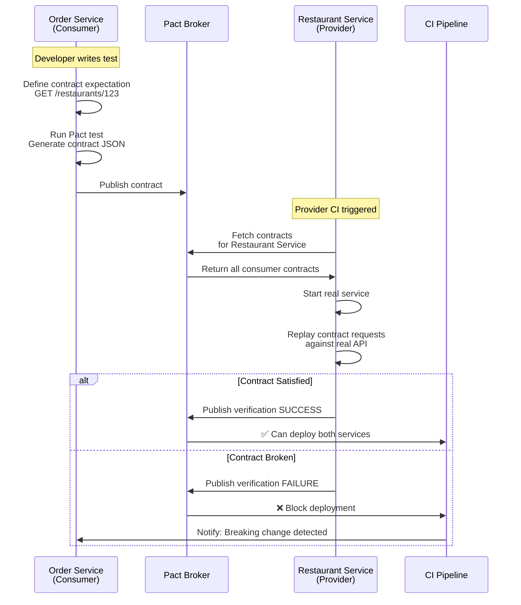
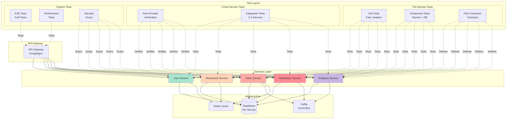
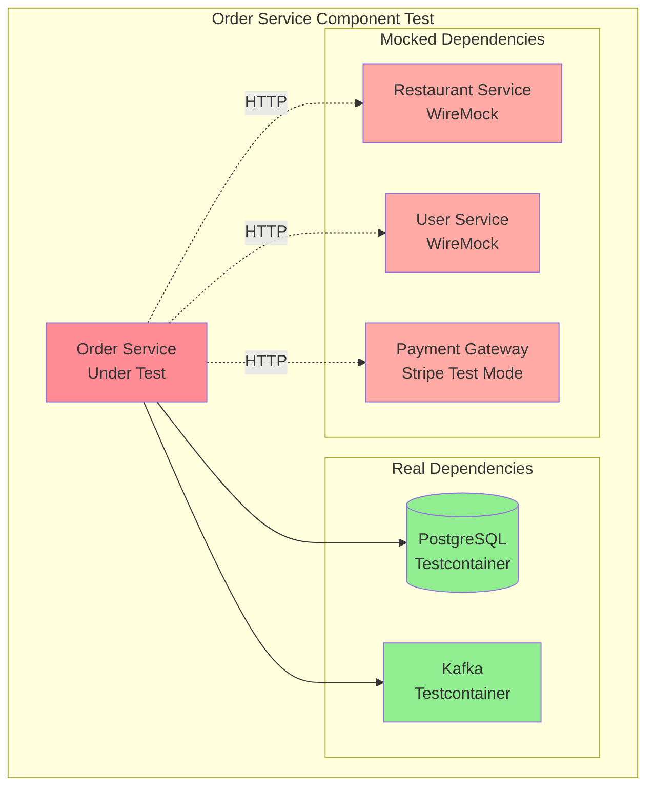
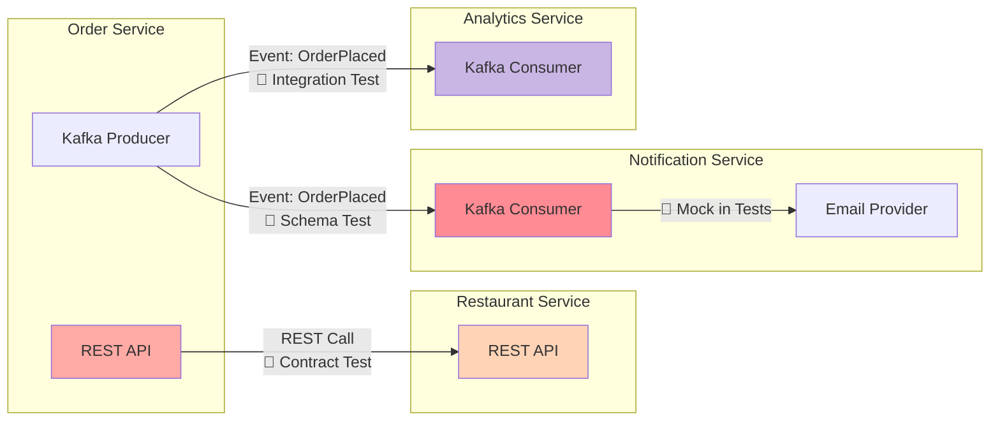
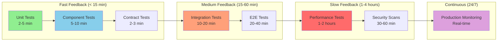
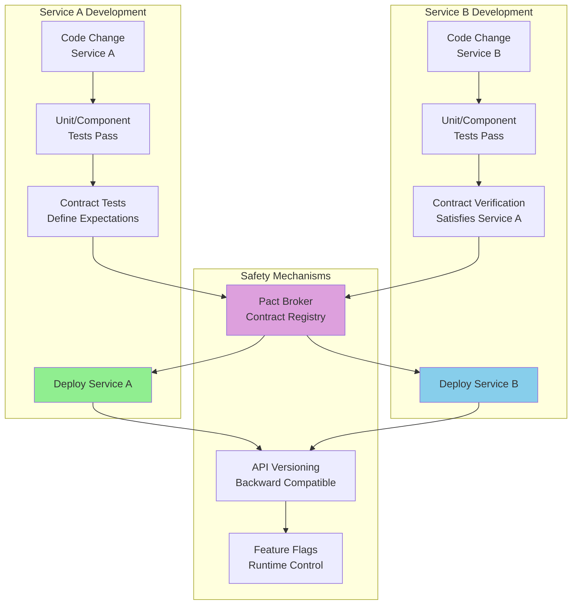

# Test Architecture - Visual Diagrams

## 1. Testing Pyramid by Service



## 2. Per-Service CI/CD Pipeline Flow

```mermaid
flowchart LR
    subgraph "Developer Workstation"
        DEV[Code Changes]
        PRE[Pre-commit Hooks<br/>Lint + Unit Tests]
    end
    
    subgraph "CI Pipeline - Per Service"
        UNIT[Unit Tests<br/>Coverage: 80%+]
        COMP[Component Tests<br/>Testcontainers]
        CON[Contract Tests<br/>Pact Consumer]
        BUILD[Build Docker<br/>Image]
    end
    
    subgraph "Cross-Service Verification"
        PACT[Pact Broker<br/>Verify Contracts]
        INTEG[Integration Tests<br/>Multi-service]
    end
    
    subgraph "Staging"
        DEPLOY_STG[Deploy to<br/>Staging K8s]
        E2E[E2E Tests<br/>Playwright]
        PERF[Performance<br/>Tests K6]
        SEC[Security<br/>Scans]
    end
    
    subgraph "Production"
        CANARY[Canary<br/>Deployment]
        SMOKE[Smoke Tests]
        MONITOR[Synthetic<br/>Monitoring]
    end
    
    DEV --> PRE
    PRE --> UNIT
    UNIT --> COMP
    COMP --> CON
    CON --> BUILD
    BUILD --> PACT
    PACT --> INTEG
    INTEG --> DEPLOY_STG
    DEPLOY_STG --> E2E
    E2E --> PERF
    PERF --> SEC
    SEC --> CANARY
    CANARY --> SMOKE
    SMOKE --> MONITOR
    
    style UNIT fill:#90ee90
    style COMP fill:#87ceeb
    style CON fill:#dda0dd
    style E2E fill:#ffa07a
    style CANARY fill:#ff6b6b
```



## 3. Contract Testing Flow (Pact)



## 4. Test Environment Progression

```mermaid
graph LR
    subgraph "Local Dev"
        L1[Unit Tests<br/>Watch Mode]
        L2[Component Tests<br/>Docker Compose]
        L3[Contract Tests<br/>Mock Provider]
    end
    
    subgraph "CI Environment"
        C1[All Per-Service Tests<br/>Isolated]
        C2[Contract Verification<br/>Pact Broker]
        C3[Integration Tests<br/>Limited Services]
    end
    
    subgraph "Staging"
        S1[All Services<br/>Production Config]
        S2[E2E Tests<br/>Critical Flows]
        S3[Performance Tests<br/>Load/Stress]
        S4[Security Scans<br/>OWASP/Snyk]
    end
    
    subgraph "Production"
        P1[Canary Deploy<br/>5% Traffic]
        P2[Smoke Tests<br/>Health Checks]
        P3[Synthetic Monitoring<br/>24/7]
    end
    
    L1 --> L2 --> L3
    L3 --> C1
    C1 --> C2 --> C3
    C3 --> S1
    S1 --> S2 --> S3 --> S4
    S4 --> P1
    P1 --> P2 --> P3
    
    style L1 fill:#e0ffe0
    style C1 fill:#e0f0ff
    style S1 fill:#fff0e0
    style P1 fill:#ffe0e0
```



## 5. Microservices Test Architecture - Complete View



## 6. Test Doubles Strategy



## 7. Service Communication & Testing Points



## 8. Test Execution Timeline (CI/CD)

```mermaid
gantt
    title Test Execution in CI/CD Pipeline
    dateFormat mm:ss
    axisFormat %M:%S
    
    section Per-Service
    Unit Tests           :00:00, 05:00
    Component Tests      :05:00, 05:00
    Contract Tests       :10:00, 02:00
    Build & Push         :12:00, 03:00
    
    section Cross-Service
    Contract Verification:15:00, 03:00
    Integration Tests    :18:00, 10:00
    
    section Staging
    Deploy to Staging    :28:00, 05:00
    E2E Tests           :33:00, 30:00
    Performance Tests    :63:00, 60:00
    Security Scans       :123:00, 30:00
    
    section Production
    Canary Deploy        :153:00, 10:00
    Smoke Tests          :163:00, 05:00
```

## 9. Feedback Loop Speed



## 10. Independent Deployment with Safety Nets



---

## Diagram Annotations

### Key Principles Illustrated

1. **Testing Pyramid:** Emphasizes more unit tests, fewer E2E tests
2. **Fast Feedback:** Per-service tests complete in < 15 minutes
3. **Contract Testing:** Enables independent deployment without full integration tests
4. **Progressive Environments:** Each environment adds confidence layers
5. **Test Doubles:** Strategic use of mocks/stubs to isolate services
6. **Parallel Execution:** Services tested independently, only critical paths tested together

### Color Coding

- 🟢 **Green:** Fast, reliable tests (Unit, Component)
- 🔵 **Blue:** Integration points (Cross-service tests)
- 🟠 **Orange:** Slower, higher-level tests (E2E, Performance)
- 🔴 **Red:** Production/Critical paths
- 🟣 **Purple:** Infrastructure/Coordination (Pact Broker, Monitoring)

### Critical Success Factors

✅ **Independent Pipelines:** Each service has its own pipeline  
✅ **Contract-Driven:** Pact prevents breaking changes  
✅ **Fast Unit/Component Tests:** Developers get feedback in minutes  
✅ **Minimal E2E:** Only critical user journeys tested end-to-end  
✅ **Production Monitoring:** Tests don't end at deployment
