# Testing Strategy Across Environments

This diagram illustrates the comprehensive testing strategy from development through production, including quality gates, test data management, and observability.

```mermaid
flowchart LR

    %% Environments
    subgraph Dev["🔧 Dev Environment (Shift-left)"]
        direction LR
        DevS1["Service 1<br/>Unit, Component,<br/>Service Integration,<br/>Contract, Doubles"]
        DevS2["Service 2<br/>Unit, Component,<br/>Service Integration,<br/>Contract, Doubles"]
        DevS3["Service 3<br/>Unit, Component,<br/>Service Integration,<br/>Contract, Doubles"]
    end

    subgraph CI["🔄 CI Environment (Shared/Ephemeral)"]
        direction LR
        CITests["Cross-service Integration<br/>System Tests<br/>Contract Testing<br/>Regression<br/><br/>Ephemeral env per PR/branch"]
    end

    subgraph Staging["🎯 Staging Environment (Prod-like)"]
        direction LR
        StagingTests["System-level Tests<br/>Full Integration<br/>Performance & Load<br/>Exploratory Testing"]
    end

    subgraph Prod["🚀 Production (Shift-right)"]
        direction LR
        ProdTests["Tests in Production<br/>Canary Checks<br/>Synthetic Probes<br/><br/>SLO & SLA Monitoring<br/>Logs & Metrics"]
    end

    %% Supporting components
    subgraph Observability["📊 Observability"]
        ObsItems["Probes<br/>Logging<br/>Metrics<br/>Traces<br/>Dashboards"]
    end

    subgraph TestData["🗄️ Test Data Management"]
        TestDataItems["Seeded Data<br/>Synthetic Data<br/>Anonymized Prod Data<br/>Test Accounts & Config"]
    end

    subgraph QDash["📈 Quality Dashboard"]
        QDashItems["CI Feedback<br/>Staging Feedback<br/>Production Feedback<br/>Quality Metrics & Trends"]
    end

    %% Flow between environments with quality gates
    Dev -->|"✅ Build & Tests Green"| QG1
    QG1{{"✓ Quality Gate 1<br/>Coverage & Critical Tests Green"}} --> CI
    
    CI -->|"✅ Integration Passed"| QG2
    QG2{{"✓ Quality Gate 2<br/>No Sev-1 Defects Open"}} --> Staging
    
    Staging -->|"✅ System Validated"| QG3
    QG3{{"✓ Quality Gate 3<br/>SLIs & SLOs Within Limits"}} --> Prod

    %% Connections to supporting components
    CI -.->|"Uses"| TestData
    Staging -.->|"Uses"| TestData

    CI -.->|"Monitors"| Observability
    Staging -.->|"Monitors"| Observability
    Prod -.->|"Monitors"| Observability

    %% Feedback loops
    CI -.->|"Reports"| QDash
    Staging -.->|"Reports"| QDash
    Prod -.->|"Reports"| QDash
    
    %% Styling
    classDef devStyle fill:#e3f2fd,stroke:#1976d2,stroke-width:2px
    classDef ciStyle fill:#fff3e0,stroke:#f57c00,stroke-width:2px
    classDef stagingStyle fill:#f3e5f5,stroke:#7b1fa2,stroke-width:2px
    classDef prodStyle fill:#e8f5e9,stroke:#388e3c,stroke-width:2px
    classDef supportStyle fill:#fce4ec,stroke:#c2185b,stroke-width:2px
    
    class Dev devStyle
    class CI ciStyle
    class Staging stagingStyle
    class Prod prodStyle
    class Observability,TestData,QDash supportStyle
```

